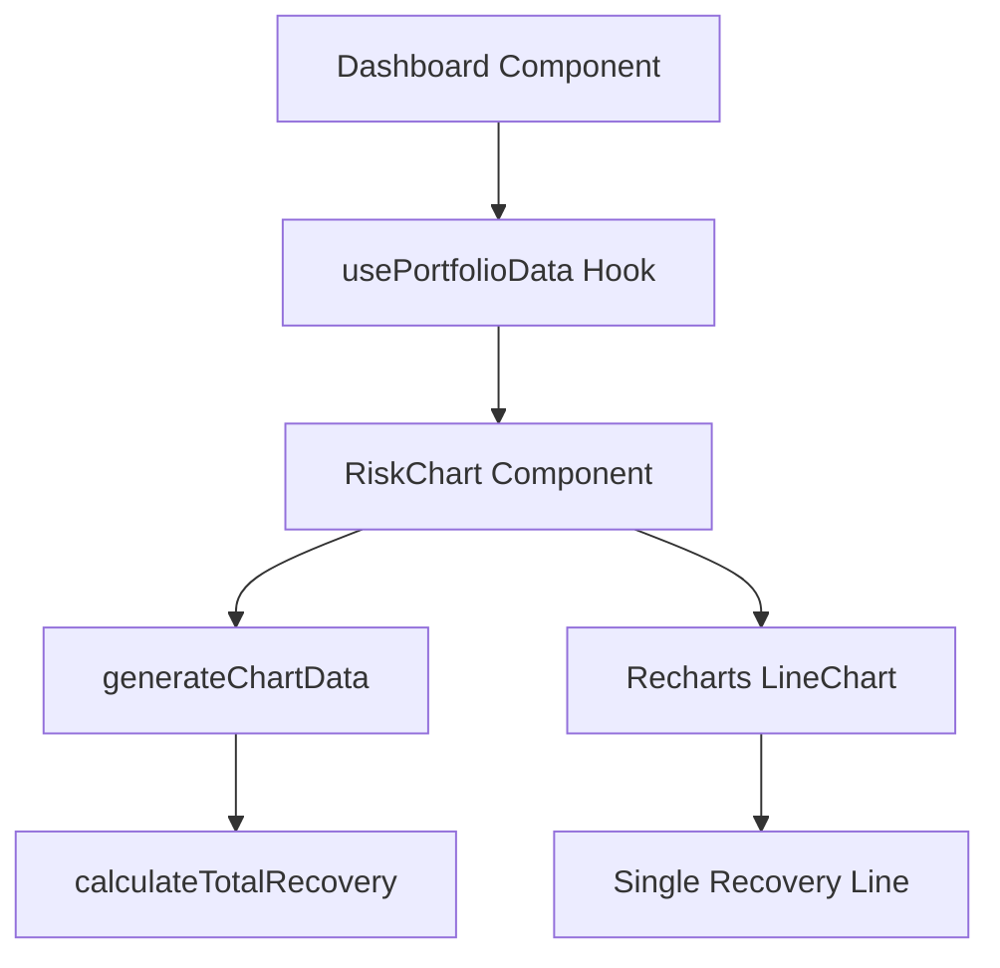

# Risk Visualization Implementation Plan

## Dependencies

Add to `frontend/package.json`:
```json
{
  "dependencies": {
    "recharts": "^2.12.0"
  }
}
```

## Component Structure

1. Create new component: `frontend/src/components/ui/RiskChart.js`
2. Integrate into Dashboard.js
3. Create utility function for calculations: `frontend/src/utils/riskCalculations.js`

## Implementation Steps

### 1. Risk Calculations Utility

```javascript
// frontend/src/utils/riskCalculations.js

/**
 * Calculate total recovery amount based on exploit severity
 * @param {number} x - Severity of exploit (0-1)
 * @param {number} aaaTokens - Amount of AAA tokens
 * @param {number} aaTokens - Amount of AA tokens
 * @returns {number} Total recovery amount in USDC
 */
export const calculateTotalRecovery = (x, aaaTokens, aaTokens) => {
  const aaaRecovery = Math.min(1, 2 * (1 - x)) * aaaTokens;
  const aaRecovery = Math.max(0, 1 - 2 * x) * aaTokens;
  return aaaRecovery + aaRecovery;
};

/**
 * Generate data points for the risk chart
 * @param {number} aaaTokens - Amount of AAA tokens
 * @param {number} aaTokens - Amount of AA tokens
 * @returns {Array} Array of data points
 */
export const generateChartData = (aaaTokens, aaTokens) => {
  const points = [];
  for (let x = 0; x <= 1; x += 0.05) { // More granular points
    points.push({
      x,
      recovery: calculateTotalRecovery(x, aaaTokens, aaTokens)
    });
  }
  return points;
};
```

### 2. Risk Chart Component

Create RiskChart component with:
- Line chart showing AAA and AA recovery curves
- Interactive tooltips
- Threshold markers
- Responsive design
- Material-UI theme integration

Key features:
- Single line showing total recovery
- Hover tooltip showing exploit severity and recoverable amount
- Clear 50% threshold marker
- Clear axis labels
- Responsive sizing

### 3. Dashboard Integration

Integrate the chart into the Dashboard component:
- Place in new section after "Portfolio by Tranche"
- Use real portfolio data
- Update when portfolio changes
- Add explanatory text

## Data Flow



## UI Layout

```
+------------------+
|   Risk Profile   |
+------------------+
|                  |
|    Line Chart    |
|                  |
+------------------+
|   Explanation    |
+------------------+
```

## Next Steps for Code Mode

1. Install recharts dependency
2. Create riskCalculations.js utility
3. Create RiskChart.js component
4. Integrate into Dashboard.js
5. Add tooltips and interactive features
6. Style and theme integration
7. Testing and refinement
