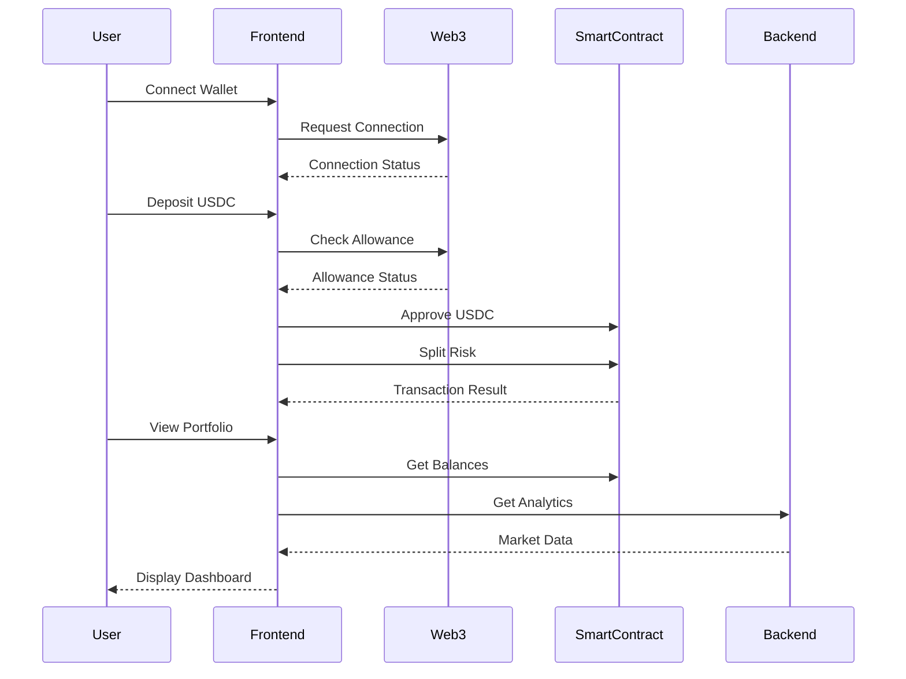

# Frontend Implementation Plan for Decentralized Insurance Protocol

## Overview

This document outlines the implementation plan for the frontend interface of our decentralized insurance protocol. The frontend will provide users with an intuitive interface to interact with the smart contracts, manage their portfolio, and monitor protocol performance.

## Core Features

### A. Portfolio Dashboard

- Display user's tranche token balances (A, B, C)
- Show current protocol status (deposit/insurance/claim period)
- Timeline visualization of important dates (S, T1, T2, T3)
- Real-time value of deposited assets

### B. Risk Split Interface

- USDC deposit interface
- Clear explanation of risk tranches
- Preview of tranche token allocation
- Gas estimation
- Transaction confirmation flow

### C. Claim Management

- Display claimable amounts per tranche
- Claim interface for each tranche type
- Batch claim functionality
- Claim history
- Transaction status tracking

### D. Analytics Dashboard

- Total Value Locked (TVL)
- Distribution across lending platforms

## Technical Architecture

## Page Structure

### A. Main Pages

1. **Home/Dashboard**

   - Protocol overview
   - User portfolio summary
   - Quick actions

2. **Deposit Page**

   - USDC deposit interface
   - Risk explanation
   - Tranche comparison
   - Transaction flow

3. **Portfolio Management**

   - Token balances
   - Claim interface
   - Transaction history
   - Performance metrics

4. **Analytics**
   - Protocol statistics
   - Market data

### B. Components

1. **Header**

   - Wallet connection
   - Network status
   - Navigation menu

2. **Transaction Components**

   - Token approval
   - Transaction confirmation
   - Status updates
   - Gas estimation

3. **Dashboard Widgets**

   - Balance cards
   - Timeline widget
   - Performance charts
   - Risk indicators

4. **Notification System**
   - Transaction alerts
   - Important dates
   - Protocol updates
   - Error messages

## Technical Stack

1. **Frontend Framework**

   - React.js
   - TypeScript
   - React Router
   - Redux/Context for state management

2. **Web3 Integration**

   - ethers.js
   - Web3Modal for wallet connection
   - ENS resolution support

3. **UI Framework**

   - Material-UI or Tailwind CSS
   - Responsive design
   - Dark/light mode support

4. **Development Tools**
   - Hardhat for local development
   - ESLint/Prettier
   - Jest for testing
   - GitHub Actions for CI/CD

## Implementation Phases

### Phase 1: Core Functionality (Weeks 1-2)

- Set up project structure and technical stack
- Implement wallet integration
- Basic deposit flow
- Simple portfolio view
- Transaction handling

### Phase 2: Enhanced Features (Weeks 3-4)

- Complete portfolio management
- Claim interface
- Basic analytics
- Improved UI/UX
- Initial testing

### Phase 3: Advanced Features (Weeks 5-6)

- Advanced analytics
- Market data integration
- Performance optimization
- Mobile responsiveness
- Comprehensive testing

## Key Considerations

1. **Security**

   - Secure wallet integration
   - Transaction signing safety
   - Data validation
   - Error handling

2. **User Experience**

   - Clear transaction flows
   - Informative error messages
   - Loading states
   - Mobile-first design

3. **Performance**

   - Efficient data fetching
   - Caching strategy
   - Optimized bundle size
   - Fast page loads

4. **Maintenance**
   - Clean code structure
   - Comprehensive documentation
   - Automated testing
   - Monitoring and analytics

## Next Steps

1. Review and approve technical stack
2. Set up development environment
3. Create project structure
4. Begin Phase 1 implementation
5. Regular progress reviews and adjustments
